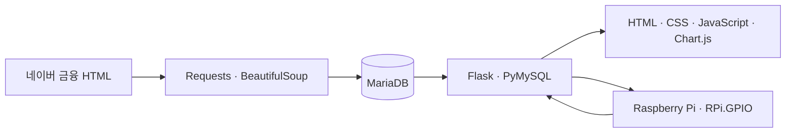

# INVESTOPIA

> 네이버 금융 주가 수집과 Raspberry Pi 주문 입력을 결합한 모의 주식 투자 시스템

## 🧑‍💻 프로젝트 정보 및 기여

| 구분 | 내용 |
| --- | --- |
| 개발 기간 | 2025.04.28–2025.06.17 |
| 팀 | 인덕대학교 3학년 B반 1조, 5명 |
| 내 역할 | 팀장·기획 및 설계 총괄·백엔드 개발 |

### 허동현 — 팀장·백엔드

- Flask 웹 서버와 MariaDB 연동
- 매수·매도 REST API, 현금·보유 수량 검증, 포트폴리오 로직 구현
- Raspberry Pi가 동일한 거래 API와 자산 데이터를 사용하도록 연동
- 프로젝트 설계와 보고서 작성 총괄

<details>
<summary>전체 팀 역할</summary>

| 이름 | 담당 |
| --- | --- |
| 김지해 | 웹 UI 설계, PPT·회의록 |
| 김진석 | 회로 설계·구축·최적화, 센서 |
| 손민석 | 설계 시각화, 회의록·발표 대본 |
| 이준호 | 웹 UI, 회로 구축, PPT·Python 코드 |

</details>

## 🔍 프로젝트 개요

> 네이버 금융에서 수집한 주가를 바탕으로 웹과 Raspberry Pi에서 가상 매수·매도를 연습하는 프로토타입입니다.

<p align="center">
  
</p>

## 💡 프로젝트 구성

### 🔗 웹 서버

- Flask 서버 렌더링 웹과 Raspberry Pi가 함께 사용하는 REST API 제공
- `POST /api/buy`, `POST /api/sell`로 종목 매수·매도 처리
- 현금 및 보유 수량 검증, 추가 매수 시 가중평균 매입가 계산
- 현금 자산, 종목 평가금액, 총자산 및 보유 포트폴리오 조회

<p align="center">
  
</p>

### 🕸 네이버 금융 HTML 수집

- Requests와 BeautifulSoup으로 네이버 금융 종목 페이지의 HTML에서 종목명과 현재가 수집
- 각 수집 루프 사이에 30초 대기하며 직전 저장 가격 대비 변동률 계산
- 현재가, 변동률, 갱신 시각을 MariaDB `stock` 테이블에 upsert

### 🧾 데이터베이스

<p align="center">
  
</p>

- `user_asset`: 가상 현금 자산 관리
- `portfolio`: 종목별 보유 수량과 평균 매입가 관리
- `stock`: 수집한 종목명, 현재가, 변동률 관리

### 🔧 하드웨어 연동 (Raspberry Pi)

<p align="center">
  
</p>

- **디스플레이**: LCD에 종목 코드, 현재가, 변동률, 현금 자산 출력
- **입력 장치**: 조이스틱으로 종목 선택, 버튼으로 1주 단위 매수/매도 API 호출
- **LED 피드백**: 조회한 종목들의 변동률 합에 따라 상승/하락 LED 표시
- **서버 연동**: 하드웨어 팀이 구축한 Raspberry Pi 회로에서 Flask REST API를 호출하도록 연동

### 🌐 웹 프론트엔드

- **index.html** – 현금·종목 평가금액·총자산과 보유 종목별 평가금액 비중 파이차트 시각화
  <p align="center">
    
  </p>

- **stocks.html** – 종목 리스트, 거래(매수/매도) 기능
  <p align="center">
    
  </p>

- **asset.html** – 자산 입력 및 설정 기능
  <p align="center">
    
  </p>

## 🚀 실행 방법

저장소의 `.env.example`을 복사해 로컬 환경 변수를 설정합니다. 실제 비밀값이 들어간 `.env`는 Git에 포함하지 않습니다.

```bash
cp .env.example .env
set -a
source .env
set +a

python3 -m venv .venv
source .venv/bin/activate
pip install -r requirements.txt
```

주가 수집기와 Flask 서버는 각각 실행합니다.

```bash
python scripts/update_prices.py
python app.py
```

Raspberry Pi에서는 GPIO 의존성을 추가로 설치한 뒤 하드웨어 제어기를 실행합니다.

```bash
pip install -r requirements-rpi.txt
python scripts/hardware.py
```

## ⚙ 아키텍처와 기술 스택



수집기가 주가를 MariaDB에 갱신하고, Flask가 같은 데이터를 웹 화면과 Raspberry Pi에 제공합니다. 두 클라이언트의 주문은 동일한 거래 API와 포트폴리오 로직을 거칩니다.

## 🧪 시연 영상 및 예시

### 1. 웹 UI에서 종목 매수
<p align="center">
  
</p>

### 2. 주가 갱신 결과

- `scripts/update_prices.py` 수집 결과가 웹과 LCD에 반영되는 흐름을 확인

### 3. LCD 종목·자산 정보 출력
<p align="center">
  
</p>

### 4. 버튼을 통한 매수 / 매도
<p align="center">
  
  
</p>

## ⚠️ 구현의 한계

1. **LCD 한글 출력 불가**: 종목 이름 대신 종목 코드 표시
<p align="center">
  
</p>

2. **30초 폴링 및 HTML 구조 의존**: 거래소 실시간 시세를 보장하지 않으며, 네이버 금융 페이지 구조가 변경되면 CSS 선택자 수정 필요
<p align="center">
  
</p>

## 📈 구현 결과

<p align="center">
  
</p>

- 현금·보유 수량 검증과 가중평균 매입가 계산을 포함한 모의 거래 로직 완성
- 웹 UI와 Raspberry Pi 입력을 하나의 Flask API·MariaDB 데이터 흐름으로 통합
